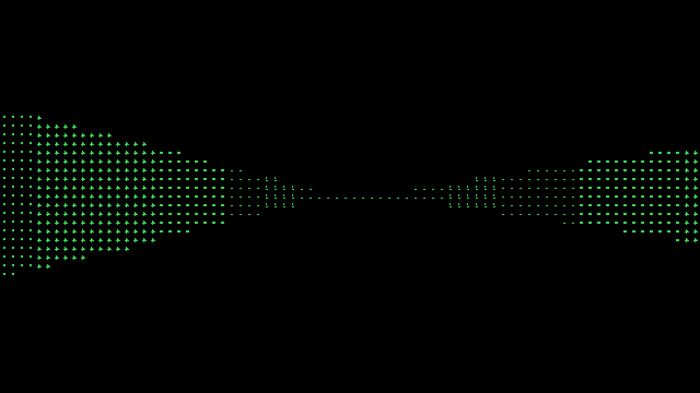

# ASCII Doom SoC v2

A multi-core DDA raycasting GPU paired with a PicoRV32 RISC-V core on Nexys A7 (Artix-7 XC7A100T), rendering a first-person ASCII Doom-like scene over VGA. The GPU block is also hardened through a full OpenLane2/sky130A ASIC flow to GDSII.

## Demo



Simulated VGA frame (80×45 character grid, rasterized offline using the real `font_rom.sv` bitmaps — see `docs/images/gen_screenshot.py`). Each column gets an independent wall-height band (near walls tall, far walls short), not a flat shaded strip — see `docs/decisions/soc_top.md`, "Real 3D wall-height rendering".

## Board
Nexys A7 — Artix-7 XC7A100T, 100 MHz

## Architecture
See [docs/arch/soc_hierarchy.md](docs/arch/soc_hierarchy.md) for the full module hierarchy and data flow (dispatcher → 4× DDA core → collector → framebuffer, PicoRV32 + AXI4-Lite fabric, DMA controller).

## Key Features
- PicoRV32 RISC-V soft core with AXI4-Lite bus (2 masters: CPU + DMA; 4 slaves: BRAM, UART, VGA framebuffer, GPU MMIO)
- Parallel DDA raycasting GPU (4 cores, parameterizable to 8) with real pseudo-3D wall-height projection (`h = NUM_ROWS/perp_dist` via a per-core hardware divider)
- VGA 640×480 @ 60 Hz with 80×45 ASCII character display, real bitmap font ROM
- Player movement via 5 onboard push-buttons, with wall collision
- Custom AXI DMA controller for autonomous data movement
- Q16.16 fixed-point arithmetic throughout
- GPU block hardened to GDSII on sky130A (OpenLane2), independent of the FPGA flow

## Setting It Up and Playing It (no hardware background needed)

This project is a small homemade computer — a CPU, a graphics chip, and a display controller — that gets loaded onto an FPGA board (a chip you can rewire with software). Once it's programmed, the board runs a Doom-style first-person maze, drawn entirely out of text characters, on a regular VGA monitor. You walk around it with the buttons on the board. No PC involved after programming — the board *is* the computer.

### What you need

- **A Digilent Nexys A7-100T board** (~$300; this exact model — the design is wired to its chip and buttons)
- **A micro-USB cable** (connects the board to your computer for programming, and powers it)
- **A monitor with a VGA input**, and a VGA cable (older monitors have this D-shaped 15-pin port; newer ones may need it via an adapter that accepts VGA *input* — a plain HDMI-to-VGA dongle pointing the wrong way won't work)
- **A Linux computer** to build and program from, with three free tools installed (one-time setup):
  1. **AMD Vivado** (free ML Standard edition — [download](https://www.xilinx.com/support/download.html); fair warning: it's a very large install, tens of GB) — turns the chip design into a file the board understands
  2. **RISC-V compiler** — builds the game program that runs on the CPU. On Ubuntu/Debian: `sudo apt install gcc-riscv64-unknown-elf`
  3. **Python 3 with Pillow** (`pip install pillow`) — generates the font, the maze map, and the math tables

### Build everything (copy-paste, ~15–30 minutes, mostly waiting on Vivado)

```bash
cd ascii_doom_soc

# 1. Build the game program + maze map
make -C software/firmware clean all

# 2. Generate the math tables and the font
bash rtl/gpu/gen_dda_luts.sh
python3 fonts/gen_font8x8.py

# 3. Build the chip design (this is the slow step)
vivado -mode batch -source synth/impl_nexys_a7.tcl \
    -log synth/out/impl.log -journal synth/out/impl.jou
```

### Program the board and play

1. Plug the board into your computer with the micro-USB cable (the port labeled **PROG**), connect the VGA cable to the monitor, and flip the board's power switch on.
2. Program it:
   ```bash
   vivado -mode batch -source synth/program_nexys_a7.tcl -nolog -nojournal
   ```
   (If this can't find the board, start Vivado's board-connection service first: `hw_server &`, then retry.)
3. The maze appears on the monitor. Walk around with the cross of five push-buttons on the board:

| Button | Action |
|--------|--------|
| BTNU (up) | Walk forward |
| BTND (down) | Walk backward |
| BTNL (left) | Turn left |
| BTNR (right) | Turn right |
| BTNC (center) | Reserved (does nothing yet) |

Walls near you look tall, far walls look short, and you slide along walls instead of stopping dead when you bump into them. There are no enemies or shooting (yet) — it's a walkable 3D maze.

The programming isn't permanent: the board forgets the design when powered off, so re-run step 2 after each power cycle. **No board?** You can still watch it work: the Simulate section below runs the whole computer in software and checks a rendered frame against a reference — the screenshot at the top of this page came from exactly that.

## Quick Start

### Simulate (Verilator + C++ testbench)
```bash
cd ascii_doom_soc

# Generated tables (gitignored, like map.hex/firmware.hex — regenerate before first build
# or after editing dda_core.sv's LUTs / adding glyphs; requires Python 3 + Pillow for the font)
bash rtl/gpu/gen_dda_luts.sh
python3 fonts/gen_font8x8.py

rm -rf sim/tb_soc/obj_dir && mkdir -p sim/tb_soc/obj_dir
verilator --cc -Wall --Wno-fatal --public-flat-rw --top-module soc_top -GSIMULATION=1 \
    -Mdir sim/tb_soc/obj_dir \
    rtl/lib/fpdiv.sv rtl/lib/fpmul.sv rtl/lib/font_rom.sv \
    rtl/bus/axi4lite_fabric.sv \
    rtl/vga/vga_sync.sv rtl/vga/char_framebuffer.sv rtl/vga/vga_top.sv \
    rtl/gpu/dda_core.sv rtl/gpu/gpu_dispatcher.sv rtl/gpu/gpu_collector.sv \
    rtl/gpu/gpu_mmio.sv rtl/gpu/gpu_top.sv \
    rtl/dma/axi_dma.sv rtl/core/uart_lite.sv rtl/core/picorv32_axi.sv \
    rtl/soc_top.sv
cd sim/tb_soc/obj_dir && make -f Vsoc_top.mk -s
g++ -std=c++17 -O2 -I . -I /usr/share/verilator/include -I /usr/share/verilator/include/vltstd \
    -c -o tb_soc_top.o ../tb_soc_top.cpp
g++ -std=c++17 -O2 -o Vsoc_top tb_soc_top.o verilated.o verilated_dpi.o verilated_threads.o \
    Vsoc_top__ALL.a -lpthread
cd ../../.. && ./sim/tb_soc/obj_dir/Vsoc_top
# Expected: Frame completed in ~16190 cycles
#   PASS: 80/80 wall characters match Python reference
#   PASS: 80/80 wall heights within expected range
```
Individual unit testbenches (DDA core, fpdiv/fpmul, VGA sync, AXI fabric/DMA, GPU top) live under `sim/unit/*` — see each subdirectory. Full rebuild/verification reference (firmware, hardware programming included): `docs/HANDOFF.md`.

### Deploy to Nexys A7 (Vivado 2025.2)
```bash
cd ascii_doom_soc
vivado -mode batch -source synth/impl_nexys_a7.tcl \
    -log synth/out/impl.log -journal synth/out/impl.jou
# Expected: 0 errors, 0 critical warnings, WNS ~+0.18 ns @ 65 MHz

# Program board (hw_server must be running)
/tools/2025.2/Vivado/bin/hw_server &
vivado -mode batch -source synth/program_nexys_a7.tcl -nolog -nojournal
```

### GDS Flow (OpenLane2 / sky130A, GPU block only)
```bash
cd ascii_doom_soc
bash rtl/gpu/gen_dda_luts.sh   # gitignored generated tables — see Simulate above
# Requires Docker; add yourself to the docker group first if needed:
#   sudo usermod -aG docker $USER   (then start a new session, or `newgrp docker`)
openlane --docker-no-tty --dockerized gds/config/config.json
# Expected: 20 MHz timing closes with margin, Magic+KLayout DRC clean, Netgen LVS clean,
# GDSII written to gds/config/runs/<run>/final/gds/gpu_top.gds
```
Full writeup, including two RTL changes needed purely for Yosys/ASIC-flow compatibility (not required by the Vivado flow): `docs/decisions/gpu_top_gds.md`.

## Performance

### FPGA — Nexys A7, Vivado 2025.2, 65 MHz (post place-and-route)

| Resource | Used | Available | % |
|----------|------|-----------|---|
| LUTs | 6,745 | 63,400 | 10.64% |
| FFs | 3,491 | 126,800 | 2.75% |
| BRAM tiles | 69.5 | 135 | 51.48% |
| DSP48 | 60 | 240 | 25% |
| MMCM | 1 | 6 | 17% |
| IO | 22 | 210 | 10.5% |

Timing: **WNS +0.180 ns** at 65 MHz, 0 failing endpoints. Frame render: 16,190 cycles (≈249 µs @ 65 MHz) for a full 80-column pseudo-3D frame with 4 parallel DDA cores.

### ASIC — sky130A, OpenLane2, 20 MHz (GPU block only: dispatcher + 4× DDA core + collector + MMIO)

| Metric | Result |
|---|---|
| Die area | 2,971,350 µm² (≈1.72 mm × 1.72 mm) |
| Core utilization | 30.36% |
| Std cells (post-techmap) | ~101,600 (2,330 flip-flops) |
| Timing (10 PVT corners, 50 ns period) | **Worst setup slack +12.48 ns**, worst hold slack +0.10 ns, 0 setup/hold violations |
| DRC (Magic + KLayout) | **PASS** |
| LVS (Netgen) | **PASS** |
| GDSII | Generated (`gpu_top.gds`, 263 MB) |

Known non-blocking follow-up (standard DFM polish, not correctness bugs — see `docs/decisions/gpu_top_gds.md`): antenna violations (215 pin/192 net) and max slew/cap warnings across all corners, addressable via diode insertion tuning and buffer insertion respectively.

## Documentation
- [Architecture](docs/arch/soc_hierarchy.md)
- [Fixed-Point Math](docs/decisions/fixed_point.md)
- [VGA Timing](docs/decisions/vga_timing.md)
- [AXI Fabric](docs/decisions/axi_fabric.md)
- [Parallel DDA](docs/decisions/parallel_dda.md)
- [DMA Controller](docs/decisions/dma_controller.md)
- [SoC Integration Decisions](docs/decisions/soc_top.md)
- [GDS Flow (gpu_top, sky130A)](docs/decisions/gpu_top_gds.md)
- [Session Handoff / Current Status](docs/HANDOFF.md)
